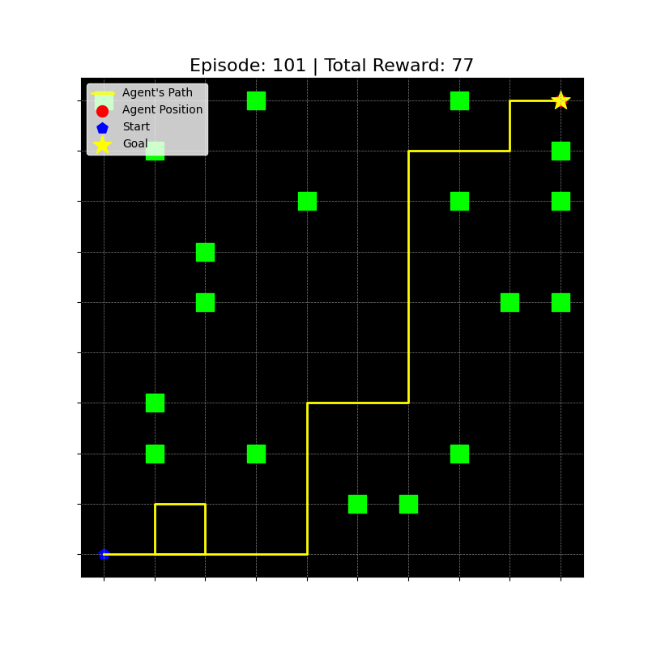
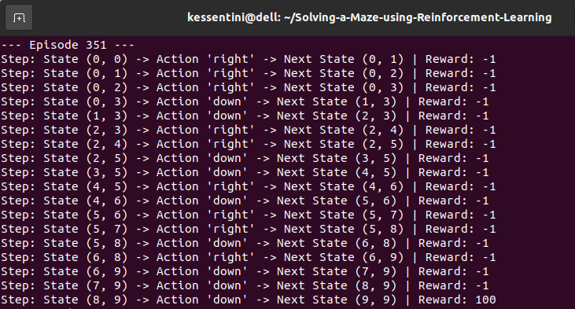

# Playing a Maze Using Reinforcement Learning

This project implements a GridWorld Environment where an agent learns to navigate from a starting position to a goal while avoiding obstacles using the Q-Learning algorithm. The implementation includes dynamic visualization to demonstrate the agent's learning process and decisions during each episode.
<br/>
<p style="text-align: center;">
  <iframe src="img/path_example.png" width="600" height="444"></iframe>
</p>


### Prerequisites

```python
pip install numpy matplotlib
```

### How It Works

  * **Maze Environment**
    
    A 10x10 grid where cells can be:
      - Start State: The initial position of the agent (default: (0, 0)).
      - Goal State: The target position of the agent (default: (9, 9)).
      - Obstacles: Randomly placed cells with a penalty (OBSTACLE = -100).
      - Free Space: All other cells.

  * **Agent Actions**
    
    The agent can move in four directions: ```up```, ```down```, ```left```, and ```right```.

  * **Q-Learning**
    - Learning Rate (ALPHA): Determines how much the Q-value is updated on each step.
    - Discount Factor (GAMMA): Prioritizes immediate vs. future rewards.
    - Epsilon-Greedy Policy (EPSILON): Balances exploration and exploitation during training.

  * **Rewards**
    - Reaching the goal: +100.
    - Stepping into free space: -1.
    - Hitting an obstacle: Position resets, with no additional penalty.

### Q-Learning Algorithm

The agent updates its Q-values using the Bellman equation:

$$
Q(s, a) \leftarrow Q(s, a) + \alpha \left[ r + \gamma \max_{a'} Q(s', a') - Q(s, a) \right]
$$

Where:
- \(s\): Current state
- \(a\): Action taken
- \(s'\): Next state
- \(r\): Reward received
- $$\(\alpha\)$$: Learning rate
- $$\(\gamma\)$$: Discount factor


### Output
  * **Plots** Visual representation of agent movement and obstacles.
  <p align="center">
    
  </p>

  * **Console Logs.** Tracks episode progress, actions, rewards, and total rewards for every 100th episode.
  <p align="center">
    
  </p>

### How to Run

Clone the repository :

```python
git clone https://github.com/Khouloud-Kessentini/Solving-a-Maze-using-Reinforcement-Learning.git
cd Solving-a-Maze-using-Reinforcement-Learning
```

Run the script
```python
python scripts.py
```

### Contributing

Contributions are welcome ! Feel free to open issues or submit pull requests to improve this project.
