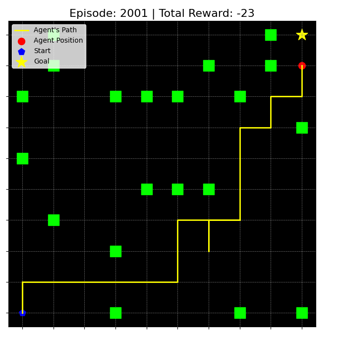

# Playing GridWorld game using Reinforcement Learning

This project implements a GridWorld Environment where an agent learns to navigate from a starting position to a goal while avoiding obstacles using the Q-Learning algorithm. The implementation includes dynamic visualization to demonstrate the agent's learning process and decisions during each episode.
<br/>


### Prerequisites

```python
pip install numpy matplotlib
```

### How It Works

  * **Maze Environment:**
        A 10x10 grid where cells can be:
            Start State: The initial position of the agent (default: (0, 0)).
            Goal State: The target position of the agent (default: (9, 9)).
            Obstacles: Randomly placed cells with a penalty (OBSTACLE = -100).
            Free Space: All other cells.

  * **Agent Actions:**
    The agent can move in four directions: up, down, left, and right.

  * **Q-Learning:**
        Learning Rate (ALPHA): Determines how much the Q-value is updated on each step.
        Discount Factor (GAMMA): Prioritizes immediate vs. future rewards.
        Epsilon-Greedy Policy (EPSILON): Balances exploration and exploitation during training.

  * **Rewards:**
        Reaching the goal: +100.
        Stepping into free space: -1.
        Hitting an obstacle: Position resets, with no additional penalty.
